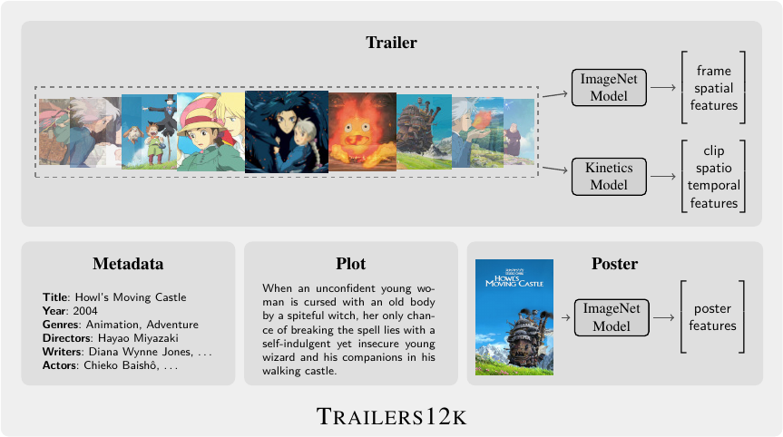
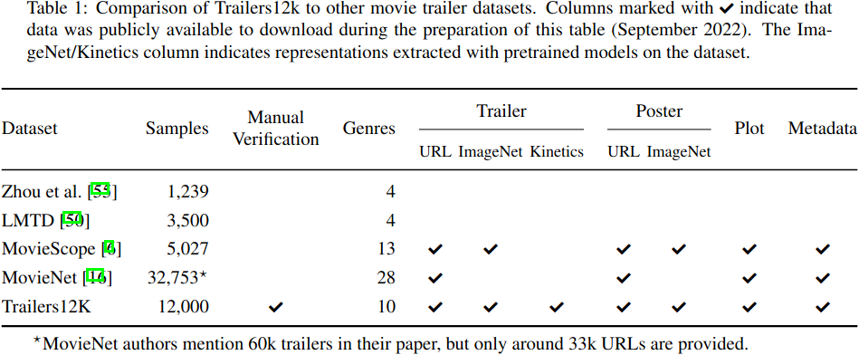

---
hide:
  - navigation
---

#



## Overview

[Trailers12k](https://doi.org/10.5281/zenodo.5716409) is a movie trailer dataset comprised of 12,000 titles associated to ten genres. It distinguishes from other datasets by its collection procedure aimed at providing a high-quality publicly available dataset. The following table compares Trailers12k to other similar datasets.



A detailed explanation of the collection procedure, statistics and computing process of trailer representations can be found in the paper [Improving Transfer Learning for Movie Trailer Genre Classification using a Dual Image and Video Transformer](https://arxiv.org/abs/2210.07983).

This dataset is an updated and polished version of [Trailers15k](https://turing.iimas.unam.mx/~bereml/project/trailers/). In addition to manually-curated movie trailers, Trailers12k provides Kinetics video clip-level representations, ImageNet poster representations and rich metadata.


## Data

All data is available on [Zenodo](https://doi.org/10.5281/zenodo.5716409) and summarized in following table:

<table>
    <thead>
        <tr>
            <th>Content</th>
            <th>Files</th>
        </tr>
    </thead>
    <tbody>
        <tr>
            <td>IMDb metadata & Youtube ids</td>
            <td><code>metadata.json</code></td>
        </tr>
        <tr>
            <td style="vertical-align:middle">Trailer representations</td>
            <td>
                <code>trailers_i_shufflenet_fpc24.zarr</code><br/>
                <code>trailers_i_resnet_fpc24.zarr</code><br/>
                <code>trailers_i_swin_fpc24.zarr</code><br/>
                <code>trailers_k_shufflenet_fps24_fpc24.zarr</code><br/>
                <code>trailers_k_r2plus1d_fps24_fpc24.zarr</code><br/>
                <code>trailers_ik_swin_fps24_fpc24.zarr</code>
            </td>
        </tr>
        <tr>
            <td>Poster representations</td>
            <td><code>posters_i_swin.zarr</code></td>
        </tr>
        <tr>
            <td>MTGC evaluation splits</td>
            <td><code>mtgc.csv</code></td>
        </tr>
        </tr>
    </tbody>
</table>

#### Trailer Representations
The following table describes trailer image (frame-level) and video (clip-level) representations:

<table>
    <thead>
        <tr>
            <th></th>
            <th>ImageNet-1k</th>
            <th>Kinetics-400</th>
            <th>Backbone</th>
            <th>File</th>
        </tr>
    </thead>
    <tbody>
        <tr>
            <td style="vertical-align:middle" rowspan="3">Frame-level</td>
            <td style="text-align:center">✔</td>
            <td></td>
            <td>2D ShuffleNet-V2-1x</td>
            <td><code>trailers_i_shufflenet_fpc24.zarr</code></td>
        </tr>
        <tr>
            <td style="text-align:center">✔</td>
            <td></td>
            <td>ResNet50</td>
            <td><code>trailers_i_resnet_fpc24.zarr</code></td>
        </tr>
        <tr>
            <td style="text-align:center">✔</td>
            <td></td>
            <td>2D Tiny Swin-Transformer</td>
            <td><code>trailers_i_swin_fpc24.zarr</code></td>
        </tr>
        <tr>
            <td style="vertical-align:middle" rowspan="3">Clip-level</td>
            <td></td>
            <td style="text-align:center">✔</td>
            <td>3D ShuffleNet-V2-1x</td>
            <td><code>trailers_k_shufflenet_fps24_fpc24.zarr</code></td>
        </tr>
        <tr>
            <td></td>
            <td style="text-align:center">✔</td>
            <td>ResNet (2+1)D</td>
            <td><code>trailers_k_r2plus1d_fps24_fpc24.zarr</code></td>
        </tr>
        <tr>
            <td style="text-align:center">✔</td>
            <td style="text-align:center">✔</td>
            <td>3D Tiny Swin-Transformer</td>
            <td><code>trailers_ik_swin_fps24_fpc24.zarr</code></td>
        </tr>
    </tbody>
</table>

Representations are stored with [`zarr`](https://zarr.readthedocs.io/en/stable/). After extraction, a trailer can be loaded with the following code:

``` python
import zarr
z = zarr.open('trailers_ik_swin_fps24_fpc24.zarr', mode='r')
num_features = z.attrs['num_features']
arr = z['tt0347149']
arr.shape, arr.dtype # ((96, 768), dtype('float32'))
```

You can see a full implementation of a Pytorch Dataset in the [DIViTA repo](https://github.com/richardtml/divita/).


#### MTGC Evaluation
`trailers12k_mtgc.csv` provides a stratified three-fold evaluation split for the multi-label genre classification task with the following columns.

* `mid`: movie identifier.
* `action`, `adventure`, `comedy`, `crime`, `drama`, `fantasy`, `horror`	`romance`, `sci-fi` & `thriller`: genres as binary labels.
* `split0`, `split1` & `split2`: subset to which the movie belongs in the split (0: training, 1: validation and 2:test).

The following snippet loads movie ids and genres of the validation subset in the third split:

``` python
import pandas as pd
df = pd.read_csv('mtgc.csv')
df = df[df['split2'] == 1]
df = df.iloc[:, 0:11]
```


## Citing
If you find this work useful in your research, please consider citing.

```
@article{Trailers12k-2023103343,
title = {Improving Transfer Learning for Movie Trailer Genre Classification using a Dual Image and Video Transformer},
journal = {Information Processing & Management},
volume = {60},
number = {3},
pages = {103343},
year = {2023},
issn = {0306-4573},
doi = {https://doi.org/10.1016/j.ipm.2023.103343},
url = {https://www.sciencedirect.com/science/article/pii/S0306457323000808},
author = {Ricardo Montalvo-Lezama and Berenice Montalvo-Lezama and Gibran Fuentes-Pineda},
keywords = {Multi-label classification, Transfer learning, Trailers12k, Spatio-temporal analysis, Video analysis, Transformer model},
}
```


## People

Please feel free to contact us if you have questions.

* [Ricardo Montalvo Lezama](https://turing.iimas.unam.mx/~ricardoml/)
* [Berenice Montalvo Lezama](https://turing.iimas.unam.mx/~bereml/)
* [Gibran Fuentes Pineda](https://turing.iimas.unam.mx/~gibranfp/)
